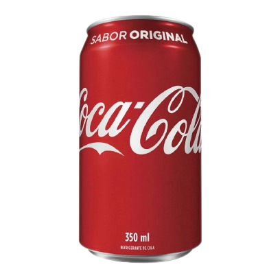

# Dev Burguer

Aplicação web de hamburgueria com cardápio interativo, carrinho de compras, páginas institucionais e fluxo simples de autenticação (criar conta, login e perfil) usando `localStorage`.

## Tecnologias utilizadas

- HTML5
- CSS3
- Tailwind CSS 4
- JavaScript (Vanilla)
- [Toastify JS](https://github.com/apvarun/toastify-js) (notificações toast)
- Font Awesome (ícones)

## Pré-requisitos

Antes de começar, você vai precisar ter instalado:

- [Node.js](https://nodejs.org/) (versão 18+ recomendada)
- npm (normalmente já vem com o Node.js)
- Navegador atualizado (Chrome, Edge, Firefox, etc.)

## Instalação e uso (passo a passo)

### 1) Clonar o projeto

```bash
git clone <URL_DO_SEU_REPOSITORIO>
cd Dev-Burguer
```

### 2) Instalar dependências

```bash
npm install
```

### 3) Compilar CSS com Tailwind (modo watch)

```bash
npm run dev
```

> Esse comando mantém o CSS em `src/styles/output.css` atualizado enquanto você edita o projeto.

### 4) Abrir o projeto no navegador

Abra o arquivo `index.html` no navegador (ou use a extensão Live Server no VS Code/Cursor).

### 5) Navegar pelas páginas

- `index.html` → Cardápio + carrinho
- `login.html` → Login
- `criar-conta.html` → Cadastro
- `perfil.html` → Perfil do usuário
- `contato.html` → Página de contato
- `sobre.html` → Sobre o projeto

## Exemplos de funcionamento (imagens/GIFs)

### Cardápio


### Bebidas e adicionais



### Fluxo sugerido para GIF de demonstração

Para mostrar o funcionamento completo (navegação, carrinho, login e perfil), grave um GIF e salve como:

`assets/demo.gif`

Depois, adicione no README:

```md

```

## Funcionalidades principais

- Cardápio com lanches e bebidas (água, sucos, cervejas e refrigerantes)
- Adição de itens ao carrinho com popup de confirmação
- Modal do carrinho com subtotal por item e total geral
- Limpeza completa do carrinho
- Persistência de carrinho no `localStorage`
- Cadastro, login e edição de perfil com persistência local
- Navbar com navegação entre páginas

## Estrutura do projeto

```bash
Dev-Burguer/
├── assets/
├── src/styles/
├── index.html
├── login.html
├── criar-conta.html
├── perfil.html
├── contato.html
├── sobre.html
├── script.js
├── auth.js
├── tailwind.config.js
└── package.json
```

## Contato

Se quiser, você pode personalizar esta seção com seus dados:

- Nome: Seu Nome
- E-mail: seuemail@exemplo.com
- LinkedIn: https://linkedin.com/in/seuusuario

## Licença

Este projeto está sob a licença **ISC**.
